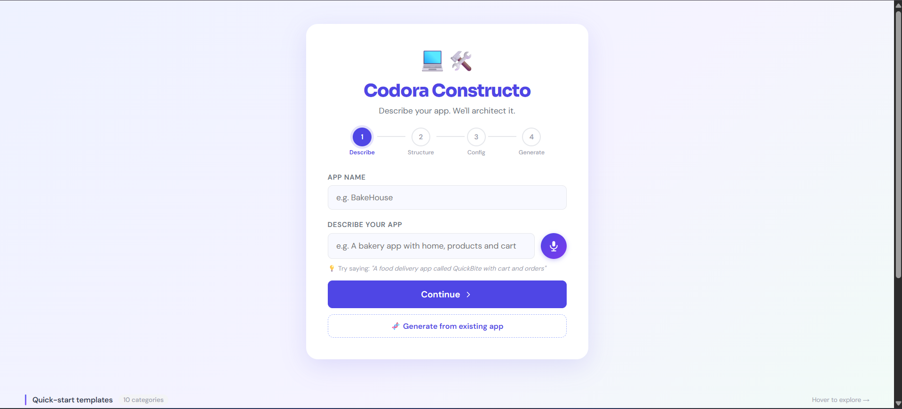
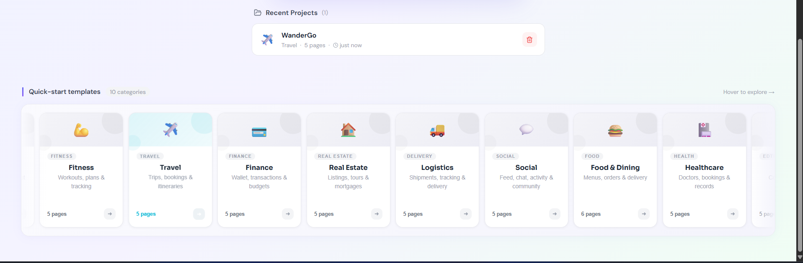
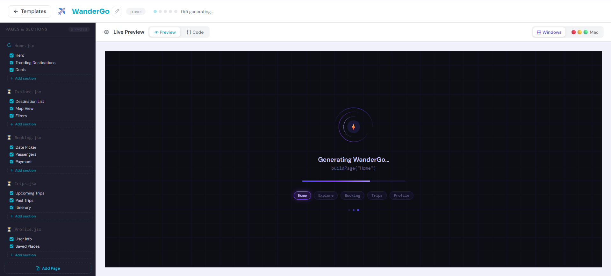
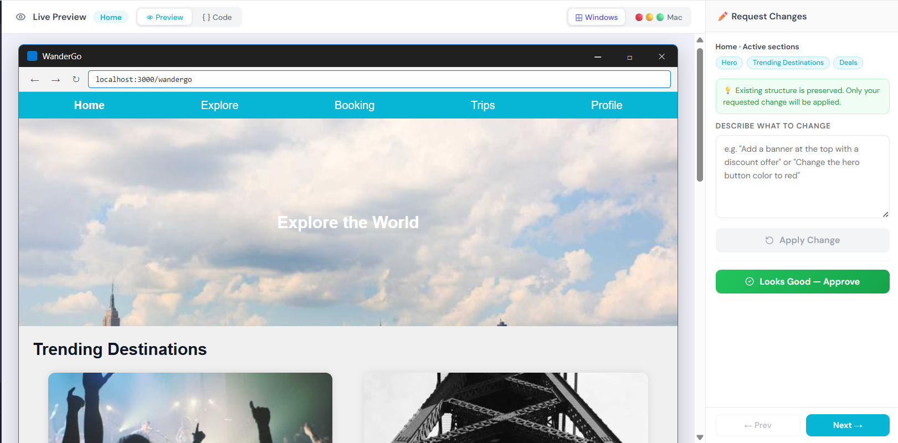

<div align="center">

# 🖥️🛠️ Codora Constructo 

### Describe it. Generate it. Download it - Your idea, running in seconds.

<blockquote> 
"I want a fitness tracker with a dashboard, workout logger, and progress charts."
<br> 
<b>— Few seconds later, you have a ZIP.</b> 
</blockquote>







</div>

---

Codora Constructo is an AI-powered web app builder. You walk in with a thought — typed, spoken, or a screenshot of an app you like — and walk out with a live-preview React application you can download.

---
 
Most AI tools give you a single component.  
A button. A form. A card.
 
**Codora Constructo gives you the whole app.**
 
Multi-page. Routed. Styled. Exportable. Real.
 
---

## Features

- 🎙️ **Voice to App** — describe your idea out loud, skip the keyboard
- 🧬 **App DNA** — paste a URL or screenshot to clone any app's structure
- 🖼️ **Template Gallery** — 10 domain categories to jump-start generation
- 🫀 **Living Prototype** — generated apps have real shared state, not static mockups
- 🖥️ **Device Frames** — preview inside a Windows 11 or Mac Safari chrome
- 📦 **ZIP Export** — download a ready-to-run React app, Router patch included
- 🗂️ **Project History** — every generation saved locally, always resumable

## Quick Start

```bash
git clone https://github.com/Shakthi111203/Codora_Constructo.git

# Backend
cd backend && npm install
echo "GROQ_API_KEY=your_key_here" > .env
npm run dev

# Frontend
npm install
npm run dev
```

<div align="center">
</div>
